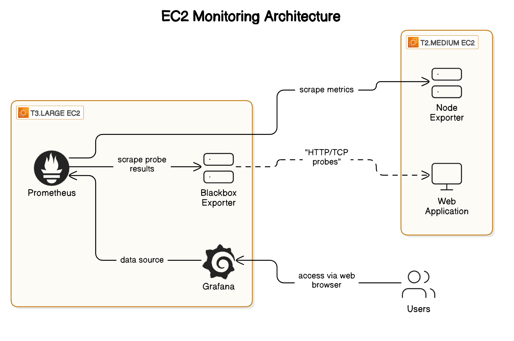

# Monitoring

## 1. Introduction to Monitoring

### What is Monitoring?
Monitoring is the process of continuously observing a system, application, or infrastructure to ensure its performance, availability, and security. It helps detect issues, optimize resources, and prevent downtime.

### Types of Monitoring

#### Infrastructure Monitoring
Tracks servers, databases, network devices, and cloud resources.

**Example:** Prometheus + Node Exporter to monitor CPU, memory, and disk usage.

#### Application Monitoring
Ensures applications run smoothly and detects performance bottlenecks.

**Example:** New Relic, Datadog, or APM tools for tracking response times and errors.

#### Network Monitoring
Monitors bandwidth usage, latency, and network security.

**Example:** Nagios, Zabbix for tracking network devices.

#### Website & API Monitoring
Ensures web services and APIs are accessible and performant.

**Example:** Blackbox Exporter for uptime monitoring and SSL expiration.

#### Log Monitoring
Collects and analyzes logs for debugging and security.

**Example:** ELK Stack (Elasticsearch, Logstash, Kibana) or Grafana Loki.

#### Security Monitoring
Detects intrusions, vulnerabilities, and threats.

**Example:** SIEM tools (Splunk, Wazuh, OSSEC).

### Importance of Monitoring

✅ Detects issues early – Identifies performance problems before failures occur.  
✅ Improves reliability – Ensures services are always available.  
✅ Enhances security – Detects unauthorized access, DDoS attacks, and vulnerabilities.  
✅ Optimizes performance – Helps manage resources efficiently.

---

## 2. Observability: Metrics, Logs, and Traces

Observability consists of three main components: **Metrics, Logs, and Traces**. Each plays a crucial role in understanding system behavior.

### 2.1 Metrics 📊 (Quantitative Data)

**Definition:** Metrics are numerical values collected at regular intervals to measure system performance and health. They provide a high-level overview and are useful for setting alerts and analyzing trends.

**Examples:**
- CPU Usage: 65%
- Memory Usage: 4GB / 8GB
- HTTP Request Latency: 120ms
- Active Users: 1,200

**Tools:**
- Prometheus (scrapes and stores metrics)
- Grafana (visualizes metrics)
- Datadog, New Relic, AWS CloudWatch

🛠 **Use Case:** Detecting high CPU usage and setting alerts when usage exceeds 90%.

---

### 2.2 Logs 📜 (Raw Event Data)

**Definition:** Logs are text-based records that capture events happening in a system. They provide detailed insights into errors, warnings, and other system activities.

**Examples:**
- Web Server Log: `"GET /home 200 OK - 123ms"`
- Application Error: `"ERROR: Database connection failed at 12:45:30 PM"`
- Security Event: `"User admin logged in from IP 192.168.1.10"`

**Tools:**
- ELK Stack (Elasticsearch, Logstash, Kibana)
- Grafana Loki
- Fluentd, Splunk, Graylog

🛠 **Use Case:** Investigating why a service crashed by analyzing error logs.

---

### 2.3 Traces 🛤 (Tracking Requests)

**Definition:** Traces follow a request as it moves through different services, helping to identify slow API calls and bottlenecks in microservices architectures.

**Examples:**

**E-commerce Transaction:**
User clicks "Buy Now" → Request hits API Gateway → Calls Inventory Service → Calls Payment Service → Generates Order Confirmation.

**Tracing Latency:**
- API Gateway → 10ms
- Inventory Service → 50ms
- Payment Service → 300ms (Slow! 🔴)

**Tools:**
- Jaeger, OpenTelemetry, Zipkin
- AWS X-Ray, Datadog APM, New Relic

🛠 **Use Case:** Finding out why an API request is slow and identifying the problematic service.

---

# EC2 Monitoring Setup with Prometheus, Node Exporter, and Blackbox Exporter




## Setup EC2 Instances

This repository sets up a monitoring system using **Prometheus**, **Grafana**, **Node Exporter**, and **Blackbox Exporter** across two EC2 instances:
- **t2.medium**: Deploys the web application and installs **Node Exporter**.
- **t3.large**: Hosts **Prometheus**, **Grafana**, and **Blackbox Exporter** to monitor and visualize the metrics.
## Overview

- **Node Exporter** collects system metrics (CPU, memory, disk, network) from the deployment server (`t2.medium`).
- **Blackbox Exporter** monitors external endpoints (HTTP, HTTPS, TCP, ICMP) for uptime, SSL certificate expiration, and response time.
- **Prometheus** scrapes metrics from **Node Exporter** and **Blackbox Exporter** to store and process data.
- **Grafana** visualizes the data from Prometheus with real-time dashboards and alerts.
We will use **t2.medium** and **t3.large** EC2 instances for deploying a web application and monitoring using Prometheus, Node Exporter, and Blackbox Exporter.

---

## 1. Deploy Web Application on EC2 t2.medium Instance

### Update and Install Dependencies

```sh
sudo apt update
sudo apt install openjdk-17-jre-headless -y
sudo apt install maven -y
```

### Clone the Repository and Build the Application

```sh
git clone <repo_url>
cd devops-monitoring-hands-on/
mvn package
```

### Run the Application

```sh
cd target/
java -jar todo-app-1.0-SNAPSHOT.jar
```

### Install and Configure Node Exporter

```sh
wget https://github.com/prometheus/node_exporter/releases/download/v1.9.0/node_exporter-1.9.0.linux-amd64.tar.gz
tar -xvf node_exporter-1.9.0.linux-amd64.tar.gz
rm node_exporter-1.9.0.linux-amd64.tar.gz
mv node_exporter-1.9.0.linux-amd64/ node_exporter
cd node_exporter/
./node_exporter &
```

---

## 2. Setup Prometheus and Blackbox Exporter on EC2 t3.large Instance

### Update System

```sh
sudo apt update
```

### Install Prometheus

```sh
wget https://github.com/prometheus/prometheus/releases/download/v2.37.0/prometheus-2.37.0.linux-amd64.tar.gz
tar -xzf prometheus-2.37.0.linux-amd64.tar.gz
cd prometheus-2.37.0.linux-amd64/
./prometheus --config.file=prometheus.yml &
```

### Install Blackbox Exporter

```sh
wget https://github.com/prometheus/blackbox_exporter/releases/latest/download/blackbox_exporter-linux-amd64.tar.gz
tar -xzf blackbox_exporter-linux-amd64.tar.gz
cd blackbox_exporter-linux-amd64/
./blackbox_exporter &
```

---

## 3. Configure Prometheus for Monitoring

Edit the `prometheus.yml` file:

```yaml
scrape_configs:
  - job_name: "node_exporter"
    static_configs:
      - targets: ["EC2-t2-medium-IP:9100"]

  - job_name: "blackbox"
    metrics_path: /probe
    params:
      module:
        - http_2xx
    static_configs:
      - targets:
          - http://prometheus.io
          - https://prometheus.io
          - http://example.com:8080
    relabel_configs:
      - source_labels: [__address__]
        target_label: __param_target
      - source_labels: [__param_target]
        target_label: instance
      - target_label: __address__
        replacement: 127.0.0.1:9115
```

Restart Prometheus after configuration:

```sh
sudo systemctl restart prometheus
```

---

## 4. Install Grafana

```sh
sudo apt-get install -y adduser libfontconfig1 musl

wget https://dl.grafana.com/enterprise/release/grafana-enterprise_11.5.2_amd64.deb

sudo dpkg -i grafana-enterprise_11.5.2_amd64.deb
```

Start Grafana service:

```sh
sudo systemctl start grafana-server
sudo systemctl enable grafana-server
```


